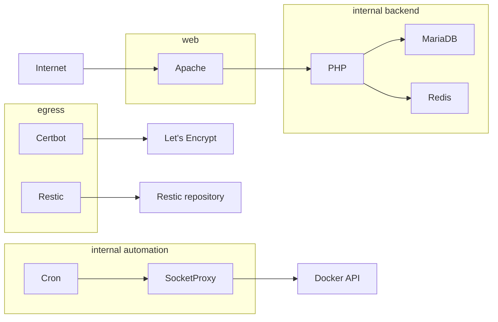

# Architecture

## Services and boundaries

| Service | Responsibility | Network exposure |
| --- | --- | --- |
| `apache` | TLS termination, HTTP/2, redirects, static files, and proxying to PHP-FPM. | Public ports 80 and 443; `web` and `backend`. |
| `php` | PHP-FPM and the Invision scheduled task. | `backend` only. |
| `mariadb` | Invision database and SQL backup/restore helper scripts. | `backend` only. |
| `redis` | Application cache. | `backend` only. |
| `cron` | Executes scheduled maintenance through the socket proxy. | `automation` only. |
| `socket-proxy` | Restricted interface to the Docker API for Cron. | `automation` only; read-only Docker socket mount. |
| `certbot` | ACME certificate issue and renewal. | `egress` only; shares the ACME webroot with Apache. |
| `restic` | Off-site backup upload, retention, and integrity checks. | `egress` only. |
| `logrotate` | Rotates host-mounted application logs. | No network. |

`backend` and `automation` are Docker internal networks. Application services
must not be attached to `automation`; otherwise they could reach the Docker
socket proxy. `web` has the public Apache port bindings, while `egress` limits
outbound-only tools to Certbot and Restic.

## Persistent data

| Data | Storage | Notes |
| --- | --- | --- |
| MariaDB data | `database` named volume | Do not remove it during normal updates. |
| Let's Encrypt certificates | `certificates` named volume | Apache mounts it read-only. |
| Application files | `WWW_DIRECTORY` host path | Supplied and licensed by the operator. |
| Logs | `LOGS_DIRECTORY` host path | Rotated by the `logrotate` container. |
| Staged backups | `BACKUP_DIRECTORY` host path | Contains the current SQL dump and application archive before Restic upload. |
| Secrets | `SECRETS_DIRECTORY` host path | Git-ignored files mounted as Compose secrets. |

All services use `no-new-privileges`; logging uses the Docker `json-file`
driver with rotation. The stack intentionally uses fixed container names, so it
is designed for one instance per Docker host.

## Client IP handling

Apache ignores `CF-Connecting-IP` by default. Supplying
`TRUSTED_PROXY_CIDRS` generates Apache `RemoteIPTrustedProxy` directives for
the listed reverse proxies. Only enable it when firewall and routing rules
ensure that clients cannot connect directly to the origin.
